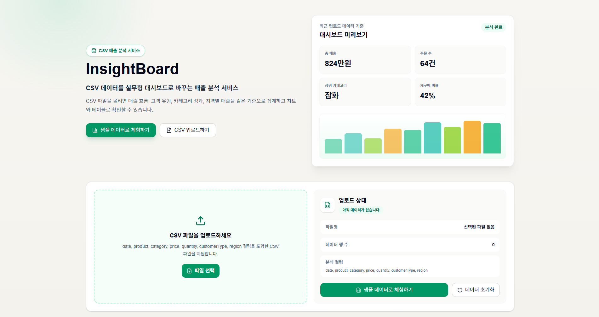

# InsightBoard

CSV 매출 데이터를 업로드해 주요 지표, 차트, 원본 테이블을 한 화면에서 확인하는 데이터 대시보드입니다.
엑셀 형태로 흩어져 있는 주문 데이터를 빠르게 훑어보고, 매출 흐름과 고객 유형, 카테고리별 성과를 비교할 수 있도록 만들었습니다.



## 주요 기능

- CSV 업로드 및 드래그 앤 드롭
- 샘플 데이터로 대시보드 바로 확인
- 총 매출, 주문 수, 판매 수량, 평균 주문 금액, 재구매 비율 KPI
- 매출 추이, 카테고리 비율, 상품 TOP 5, 지역별 매출 차트
- 검색, 카테고리, 고객 유형, 지역, 날짜 범위 필터
- 날짜, 매출, 수량 기준 정렬
- 10개 단위 테이블 페이지네이션
- 필터 결과 CSV 다운로드
- 브라우저 인쇄 기반 리포트 저장
- 집계 결과 기반 인사이트 카드

## 기술 스택

- Next.js
- TypeScript
- Tailwind CSS
- Recharts
- Vercel

## 실행 방법

```bash
npm install
npm run dev
```

기본 주소는 `http://localhost:3000`입니다.

## 빌드

```bash
npm run build
```

## CSV 형식

필수 컬럼은 아래와 같습니다.

```csv
date,product,category,price,quantity,customerType,region
2026-06-01,에코백,패션,29000,2,신규,서울
2026-06-02,파우치,잡화,15000,1,재구매,부산
2026-06-03,키링,잡화,8000,3,신규,인천
```

`customerType`은 `신규`, `재구매`, `New`, `Returning` 값을 지원합니다.

## 구현 범위

- 서비스 화면 구성 및 반응형 UI
- CSV 파싱과 데이터 검증
- KPI 계산 로직
- 차트 시각화
- 필터링/정렬/페이지네이션 테이블
- CSV 다운로드
- 리포트 저장용 print 스타일

## 포트폴리오 메모

InsightBoard는 별도 백엔드 없이 브라우저에서 CSV를 읽고 계산하는 구조입니다.
필터 조건이 바뀌면 KPI, 차트, 인사이트, 테이블이 같은 기준으로 갱신되도록 구성했습니다.
